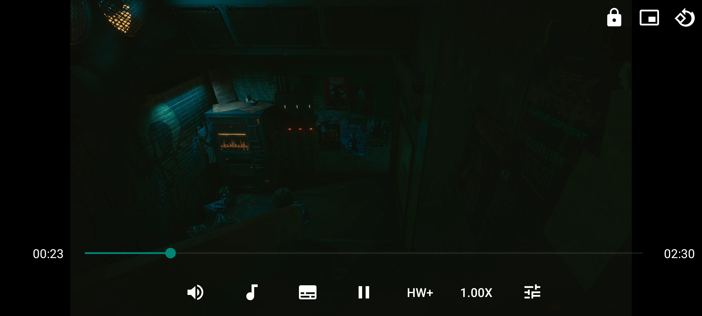

# mpv for Android (Fork)

> [!IMPORTANT]
> This is a customized fork of [mpv-android](https://github.com/mpv-android/mpv-android). It features a simplified UI, enhanced playback controls, and is strictly focused on intent-based opening.

## Features (Fork Specific)

* **Strict Intent Opening**: File browsing has been removed. Open files directly from other apps or via CLI.
* **Modern UI**: Clean, translucent player overlay with no dark semi-transparent backgrounds.
* **Pinch-to-Zoom & Pan**: Smooth, high-performance pinch-to-zoom and two-finger panning.
* **Enhanced Controls**: 
    * Unified grid-based menus for Audio, Subtitles, Speed, and Decoder.
    * Playback speed from 0.01x to 8.0x.
    * Direct access to video adjustments (Brightness, Contrast, Gamma, Saturation).
    * Toggle mute button with dynamic icons.
    * Top-bar screen orientation switch.
* **Simplified Gestures**: 
    * One-finger horizontal swipe to seek.
    * Tap and hold for temporary 2x speed boost.
    * Vertical gestures and zone-taps disabled to prevent accidents.
* **Automatic Background Playback**: Resumes in background automatically when leaving the app.
* **Subtitle Settings**: Option to disable automatic subtitle showing.

## Original Features

* Hardware and software video decoding
* libass support for styled subtitles
* Secondary (or dual) subtitle support
* High-quality rendering with advanced settings (scalers, debanding, interpolation, ...)
* Play network streams with the "Open URL" function
* Picture-in-Picture, keyboard input supported

### Library?

mpv-android is **not** a library/module (AAR) you can import into your app.

If you'd like to use libmpv in your app you can use our code as inspiration.
The important parts are [`MPVLib`](app/src/main/java/is/xyz/mpv/MPVLib.kt), [`BaseMPVView`](app/src/main/java/is/xyz/mpv/BaseMPVView.kt) and the [native code](app/src/main/jni/).
Native code is built by [these scripts](buildscripts/).

## Downloads

You can download this version from the [Releases section](https://github.com/mpv-android/mpv-android/releases).

## Building from source

Take a look at the [README](buildscripts/README.md) inside the `buildscripts` directory.

Some other documentation can be found at this [link](http://mpv-android.github.io/mpv-android/).
